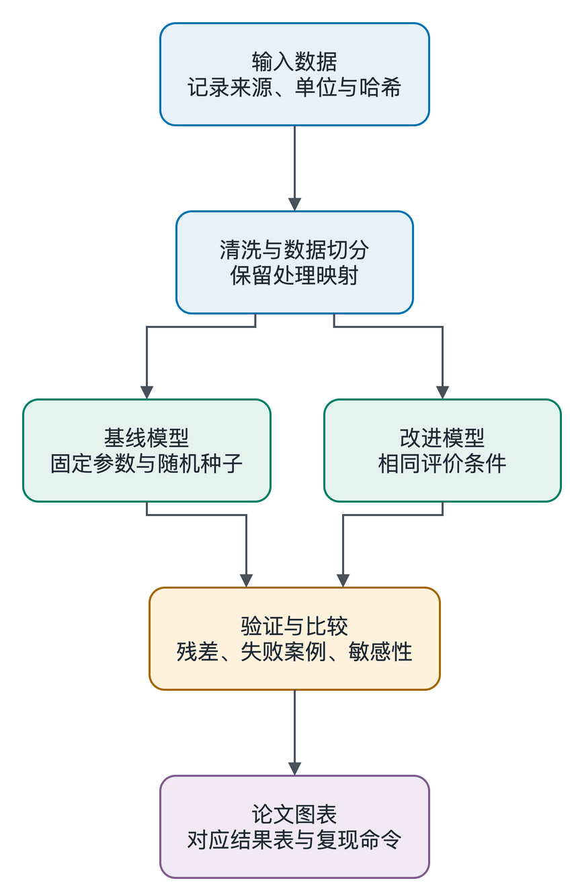

# huaweicup2026

华为杯数学建模团队工作区。仓库：<https://github.com/huaweibei123/huaweicup2026>。

按教学演示第 6–8 屏及附录手册建立：统一环境、可复跑实验、任务卡、分支协作和可追溯论文。当前已导入 A 题冻结原件，正并行推进形式化、精确评估与情况 A/B 构造搜索；下面的拟合示例仍是合成数据，不能当作本队赛题实验。

A 题源题与附件在 [data/raw/a](data/raw/a/)，100 个原始 JSON 打包在 `official-cases.zip`；执行 `uv run python scripts/a_materials.py --extract` 解压并校验。本机 `Problem A/` 是内容一致的留存副本，不需要重复提交；[115 文件对照报告](docs/a/MATERIAL_SYNC_CHECK_20260924.md)。完整 Pro 问答和 AI 生成附件见 [AI chats 索引](AI%20chats/README.md)，当前任务见 [团队分工](docs/TEAM.md)。

## 第一次运行

先安装 [Git](https://git-scm.com/downloads)、[uv](https://docs.astral.sh/uv/getting-started/installation/)；通信另外需要 [GitHub CLI](https://cli.github.com/)。组织私有仓库需要相应访问权限。

```sh
git clone https://github.com/huaweibei123/huaweicup2026.git
cd huaweicup2026
uv sync --locked
uv run python src/demo.py
```

命令在 macOS/Linux 终端或 Windows PowerShell 中逐行执行。项目使用 Python 3.12；uv 可按 `.python-version` 获取解释器。`uv.lock` 固定 Python 包版本，TeX 和 GitHub CLI 独立安装。

macOS 的 ExFAT 外置盘可能产生 `._*` 元数据文件，导致依赖安装或 Matplotlib 样式读取失败。若错误路径指向 `.venv` 内的 `._*`，在项目根目录执行 `dot_clean .venv` 后重试 `uv sync --locked`。这只处理可重建的本项目虚拟环境，不清理原始数据或整盘。

示例比较普通最小二乘与 Soft-L1 稳健拟合，随机种子固定为 2026；数据在内存合成，输出为：

- `results/demo/input.csv`：合成观测、真值与离群点标记。
- `results/demo/predictions.csv`、`metrics.csv`：预测、带单位的参数与误差。
- `results/demo/run.json`：实际命令、随机种子、参数、环境版本、Git 状态及输入/脚本/锁文件哈希。
- `figures/demo/fit.png`、`fit.pdf`：对比图。

这些演示产物可以重新生成，默认不提交；正式实验应使用独立运行目录并提交经过验收的结果。示例不能当作真实赛题结果，也不复刻课件中另一组教学数值。

## 目录

```text
.
├── .agents/skills/
│   ├── team-mailbox/            # GitHub Issues 团队通信
│   ├── system-atlas/            # 0.5.0 系统设计、共享任务看板
│   ├── scientific-figures/      # 项目科研绘图约定与 ELK → Draw.io 排版
│   └── scientific-figure-making/ # figures4papers 的 Matplotlib 论文图配方
├── .github/                    # PR / 任务卡模板、跨平台示例检查
├── AGENTS.md                   # Agent 协作和实验约定
├── pyproject.toml / uv.lock     # Python 依赖及固定版本
├── data/
│   ├── raw/                    # 原始数据，只读，保留来源与哈希
│   └── processed/              # 可重新生成的清洗数据，记录来源
├── src/demo.py                 # 可运行的合成拟合示例
├── results/                    # CSV 指标、运行记录、失败案例
├── figures/                    # 论文 PDF / PNG 图件
├── paper/template-2026/         # 当前 2026 论文模板
├── tasks/                      # 六字段任务卡
└── docs/                       # 分工、通信、来源与 Skill 调研
```

## 团队协作

每个人负责自己任务的模型/代码、证据和论文段落，由整合负责人统一验收。先复制 [任务卡](tasks/TEMPLATE.md) 约定输入、输出和验收标准，再从 `main` 建功能分支，提交后推送并发起 PR。

```sh
git switch main
git pull --ff-only
git switch -c feat/q1-baseline
# 完成任务后逐项检查、提交指定文件
git diff
git add src/your_script.py tasks/your_task.md
git commit -m "feat: add q1 baseline"
git push -u origin feat/q1-baseline
```

路径与分支名是示例，需要替换。PR 写明真实运行命令、结果和未验证项，按 [PR 模板](.github/pull_request_template.md) 交付；本项目按[免费协作规范](docs/GITHUB_FREE_COLLABORATION.md)停用 GitHub Actions，在本机或队友电脑验证并标明实际平台；检查通过不等于模型正确或论文验收。

## 队友通信

已将 [NikolaStarx/team-mailbox](https://github.com/NikolaStarx/team-mailbox) 放入 `.agents/skills/team-mailbox/`。每位队友克隆仓库后使用自己的 GitHub 身份：

```sh
gh auth login --hostname github.com
gh api user --jq .login
uv run python .agents/skills/team-mailbox/scripts/mailbox.py init
uv run python .agents/skills/team-mailbox/scripts/mailbox.py check --full
```

完整查收后，Agent 还需逐个读取返回索引中的话题全文。任务通过 Issue 留言和 `@GitHub账号` 寻址，成果通过 PR 交付。默认无 Hook、无自动回信、无空闲唤醒。详见 [团队通信](docs/TEAM.md) 和 [Skill](.agents/skills/team-mailbox/SKILL.md)。

## 真机联测

队长和队友准备好了以后，从 [联测入口](docs/rehearsal/START_HERE.md) 开始，分别把 [队长提示词](docs/rehearsal/LEADER_PROMPT.md) 和 [队员提示词](docs/rehearsal/MEMBER_PROMPT.md) 发给自己的 Agent。支持显式读取 Skill 的其他 Agent；使用真实账号、独立机器和同一 run ID。预演包括通信、任务分配、实际执行、回执回读、冲突与离线恢复；另有 [每人网页、Agent 读取与成本验收](docs/rehearsal/READER_CHECKS.md)，检查八种查询策略、分页和增量，分别记录接口、理解与实际用量。当前仅完成材料和本机机制验证，**真机联测待你们进行**。

## 系统设计与图谱协作

已安装 [System Atlas 0.5.0](.agents/skills/system-atlas/SKILL.md)，完整保留渲染器、团队协作代码、文档与测试。它让 Human 和 Agent 查看同一份已确认模型，支持队长发布、节点/字段授权、签名变更请求和冲突回执；0.5.0 新增共享任务看板、任务分配标签与明确的任务字段授权。需要 Node.js 18+，本项目使用 Node.js 22 验证。Atlas 0.5.0 原生 Windows 状态写入存在已复现问题，Windows 队友使用 WSL2/Linux，详见联测入口。

从项目根目录体验随附示例：

```sh
node .agents/skills/system-atlas/bin/system-atlas.mjs preview .agents/skills/system-atlas/examples/service.system.json --repo-root .agents/skills/system-atlas
```

打开终端打印的本机地址，结束时按 Ctrl-C。示例为上游演示模型，不代表本队建模方案。项目接入、测试和多人协作边界见 [System Atlas 使用说明](docs/SYSTEM_ATLAS.md)。实际成员授权与团队同步尚未初始化。

## 论文和资料

科研绘图使用 [scientific-figures](.agents/skills/scientific-figures/SKILL.md)。从“精算云画图”原型抽取的排版工具已接入；见 [Draw.io 使用方法](.agents/skills/scientific-figures/references/drawio.md) 和 [可编辑示例](figures/workflow/modeling-workflow.drawio)。



排版工具需 Node.js 22+；`npm ci --ignore-scripts --prefix .agents/skills/scientific-figures` 安装固定依赖。PNG / PDF 导出另需 Draw.io Desktop；数据图继续使用现有 Python 环境。

先看 [论文说明](paper/README.md)：`paper/template-2026/` 已替换 2025 训练模板；正式格式以当届公告为准。来源见 [SOURCES](docs/SOURCES.md)。模板示例正文、数据、图和参考文献不是团队成果。

数学建模相关 Skill 的选型见 [原调研报告](docs/SKILLS_RESEARCH.md)；科研绘图、Python / MATLAB / Wolfram / Julia 与 Astra 适配见 [绘图专项报告](docs/FIGURE_SKILLS_RESEARCH.md)。用户指定的 [figures4papers / scientific-figure-making](.agents/skills/scientific-figure-making/SKILL.md) 已安装，提供 Matplotlib 图形设计与代码配方，许可为 CC BY-NC 4.0，来源见 [安装记录](docs/FIGURES4PAPERS.md)。其他调研候选尚未安装。当前项目有四个 Skill。
