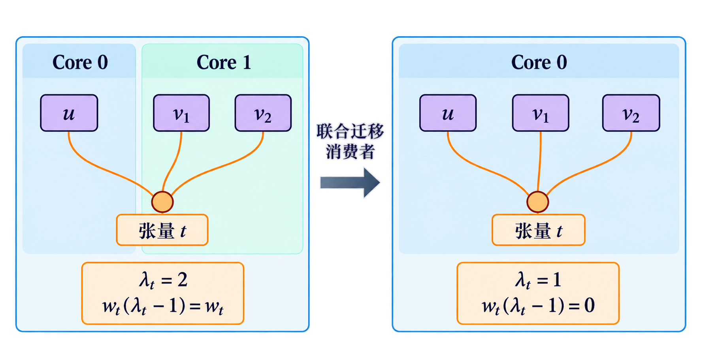

# 问题二：复用感知的超图分核与空隙插入

## 同核合并改变了什么

问题二把同一 Core 上的子图合并为一个 Task。同核依赖可以保留核内数据，跨核依赖才插入边界 COPY，并在源 COPY_OUT 完成后经过 500 cycles 才允许目标 COPY_IN 进入相应就绪判定。于是，拆成 singleton 子图不再等于为每个操作设置独立 Task 屏障；子图顺序成为影响固定核内调度的重要输入。

这一变化同时带来机会和压力。把共享数据的操作放在同核可减少重复搬运，但数据驻留时间可能延长；按计算负载分散消费者可改善并行度，却扩大触及 Core 集合和跨核同步。本文分别构造计算日历代理与精确的预换入换出 COPY 费用，再由完整方案评价决定二者的最终取舍。

## 链与汇合感知的空隙插入

对计算依赖图识别可连续处理的链以及分叉、汇合位置。每个 Core 的 M、V Pipe 维护已安排区间集合，候选操作必须在依赖释放后寻找足够长的空隙。相比仅在某核当前尾部追加工作，空隙插入可以利用前序等待留下的可用窗口。

设操作 $v$ 的代理释放时刻为 $r_v$，计算时长为 $d_v$。对 Core $k$、Pipe $p_v$ 的占用日历 $\mathcal I_{k,p_v}$，选择最早满足

$$[s_v,s_v+d_v)\cap\mathcal I_{k,p_v}=\varnothing,\qquad s_v\ge r_v$$

的区间。汇合附近的相关链使用至多 $K^2$ 个核对联合比较，使一个支路的局部选择考虑到另一个支路的完成位置。输出以 singleton 子图及其优先序表达，后续仍由官方规则生成实际流水。

这个日历模型故意保持可计算：它不完整模拟共享 DDR、公平分带宽、spill 与 memory-credit。$s_v$ 是构造代理时刻，不是官方 trace，不是 Makespan 的保守上下界。日历的价值在于产生结构合理的候选，而不是取代官方执行。

::: figure-plan {#fig-p2-transition}
**图稿 F06｜从 P1 的 Task 边界到 P2 的驻留复用。**

- 延续 F01/F03 的同一原图坐标，放大一个张量的多个消费者；左为 P1 子图边界，中为 P2 同核合并，右为 P2 跨核分配。
- 同核合并后将原 DDR 往返淡出，保留真实依赖，新增“存活至最后一次使用”的水平条；跨核方案高亮 500 cycles COPY 释放条件。
- 每种方案底部列出可由原图及分配直接核算的预 Step2 COPY 字节。没有完整结果时不列 M，不声称此局部减少多少周期。
- 显示张量字节、消费者 Core 集合和同核复用次数；与后续超图公式逐项对应。用相同 Core 泳道，明确改变的是编译规则而非原始运算。
:::

## 按触及 Core 数计费的超图模型

普通图切割按边累加费用，容易对同一张量的多消费者重复计费。超图用一条超边连接同一数据相关的全部操作，以触及 Core 数描述通信，这种建模思想与并行稀疏矩阵计算中的通信建模相通[3]。本文根据官方边界复制语义构造具体费用。

要求非 COPY 操作集合完整、物理张量不带逻辑别名、每个物理张量至多有一个原生产者，张量大小为非负整数。对超边 $e$，令 $\lambda_e(a)$ 为其端点所触及的不同 Core 数，$w_e$ 为字节权重。则预 Step2 的原始 COPY 费用写成

$$D_{\mathrm{pre2}}(a)=C+\sum_{e\in\mathcal H}w_e\bigl(\lambda_e(a)-1\bigr).$$

对于核外输入，消费者每增加一个触及的 Core，就增加一次大小为 $b_t$ 的输入复制，故权重为 $b_t$；基础的一次输入包含在常数 $C$ 中。对于由计算产生的中间张量，超边包含生产者和消费者，官方边界构造按远端核所需的输出/输入对计费，权重为 $2b_t$；最终输出等与分核无关的部分计入 $C$。实际实现按官方边界规则处理，不能把所有边一律赋为相同权重。

该公式精确描述适用域内的预 Step2 COPY 字节，不包含容量不足引发的换入换出，也不表达传输之间的重叠或串行。若一组操作 $A$ 从 Core $u$ 移往 $v$，只需检查接触 $A$ 的超边。对某条超边，目标核原先无端点时费用增加一个 $w_e$；源核全部端点都迁出时费用减少一个 $w_e$。由此可增量计算

$$\Delta_e=w_e\left(\mathbf1\{n_{e,v}=0\}-\mathbf1\{n_{e,u}=|e\cap A|\}\right).$$

这也解释了单结点逐次迁移可能看不到组合收益：第一步迁移增加目标核触及数，只有最后一个源端点迁出时才消除源核费用。局部联合改动比纯逐点贪心更适合保留复用结构。

以一个张量的超边为例，令 $u$ 为生产者，$v_1,v_2$ 为两个消费者，并以 $t$ 标记该张量对应的超边。将两个消费者中的一个迁入生产者所在 Core 后，另一个消费者仍使超边触及两个 Core，费用项暂不下降；只有两个消费者都迁入时，$\lambda_t$ 才从 2 降为 1，对应费用项从 $w_t$ 降为 0。图中的变化仅针对该超边，不能解释为完整方案的 COPY 字节全部归零。

{#fig:hypercut width=100%}

这一局部字节收益仍需接受执行层的检验：联合迁移可能同时改变计算负载、数据驻留和同步位置，而上述费用没有刻画共享带宽、容量换入换出及流水重叠。下一步因此对局部割加入负载守卫，再用完整方案评价判断 Makespan 是否改善。

## 带锚点的两核局部细化与负载守卫

在已构造的 gap 方案上，算法选择核对与最多 16 条链组成的局部区域。区域之外的操作及必须固定的链作为锚点，区域内操作具有两种 Core 标签。对固定区域和锚点，超边“是否同时触及两侧”的费用可通过辅助结点构造成二标签最小割问题，得到该局部字节目标的精确解。

但无约束最小割可能将多数工作迁入同一 Core，造成计算负载失衡。实现为各核各 Pipe 设置工作帽；若新分配违反工作帽，逐步将部分迁入链锚回原核后重新求割。原分配始终是可行参考，最多 $r+1$ 次割（$r\le16$）后得到满足守卫的接受候选或保留原分配。每次接受还要求字节数不增加。

**命题 5.1（局部费用单调性）。** 若每轮锚点均保持原分配可行，局部割求得其当前无额外工作帽子问题的精确最优值，且接受前重新核对工作帽，则最终接受方案在该局部预 Step2 COPY 目标上不劣于原分配。

**证明。** 当前锚点约束下原分配可行，因此精确最小割值不大于原分配值。若工作帽不满足，则增加与原分配相容的锚点，不改变原分配可行性。每轮仍保留这一费用上界。只有同时通过工作帽和实际费用检查的候选才接受，结论成立。$\square$

该过程不等于带所有负载约束的全局精确最小割。新增锚点会缩小可行域，也未纳入容量、共享带宽或真实 Makespan。本文将其称为带守卫的局部字节细化，避免把局部精确性误写为多核调度全局最优。


## 完整候选策略与复杂度

**算法 2：复用感知的有界完整方案选择。**

```text
输入：G、K、冻结配置及完整方案评分接口
1 生成结构自适应基线 P0
2 构造链/汇合感知 gap 方案 P1；不适用时返回 P0
3 在 P1 上做两核、至多16链的超图细化
4 仅当预 Step2 COPY 严格下降时，对细化分配重新安排次序，形成 P2
5 保留未经细化的 P1；按 P0、P1、P2 的构造顺序去重
6 对至多三个完整计划在线评分，按 (Makespan, added COPY) 字典序择优
7 同分保留先前方案；失败按固定回退规则处理；输出合法两字段 JSON
```

保留 $P_1$ 很关键：预 Step2 字节没有下降，只能说明不触发细化后重排，不能据此删除原 gap 方案。在线最终选择并不以字节代理代替 Makespan。

设图中有 $n$ 个计算操作、$m$ 条投影依赖，日历查询累计扫描成本为 $Q$；链、汇合识别与相应排序的成本由 $n,m$ 决定。若有 $R$ 个局部细化区域，区域辅助网络规模为 $(n_r,m_r)$，一次最小割成本为 $T_{\mathrm{cut}}(n_r,m_r)$，则细化总成本不超过

$$\sum_{r=1}^{R}(w_r+1)T_{\mathrm{cut}}(n_r,m_r),\qquad w_r\le16.$$

日历插入及核对比较还包含 $Q$ 与 $K^2$ 因子，因此不将其笼统称为线性算法。最昂贵的完整方案在线评分最多三次，区域局部割不调用完整评价器。各阶段时间均计入求解墙钟。

## 完整结果与通信—时间取舍

冻结求解器在全部 500 格上输出合法结果，使用 1131 次原生 E2 评分和 500 次独立 E0 复评，未触发 E0 fallback。主结果为：

| 核数 | 1 | 2 | 3 | 4 | 5 |
|---|---:|---:|---:|---:|---:|
| 官方口径平均加速比 | 1.0000 | 2.3167 | 3.2356 | 3.9711 | 4.5498 |
| 优化方案的 $\operatorname{mean}(B/M)$ | 1.2061 | 2.3167 | 3.2356 | 3.9711 | 4.5498 |
| 对前版改善/持平/退化 | 59/41/0 | 64/36/0 | 54/46/0 | 49/51/0 | 42/58/0 |

相对前一完整版本，500 格共有 268 格 Makespan 改善、232 格持平、0 格退化，涉及至少一个核数改善的图有 69 个。这个结果证明固定组合策略在本组已知官方图上的经验表现，不能证明每个组成机制对所有输入独立保优。

全部 500 格的额外 DDR 总量由 3043860416 B 增至 4159738560 B，增加约 36.66%。其中 55 格时间与搬运均改善，199 格时间改善而搬运增加，14 格时间改善且搬运不变，232 格两者持平。更大的总搬运伴随更短 Makespan，表明仅最小化通信字节不足以描述本题主要目标。

求解墙钟均值为 4.029 s，最近秩定义的 P95 为 18.841 s，最大值为 40.187 s；外部独立 E0 的均值为 1.410 s、P95 为 6.592 s、最大值为 13.980 s。实验使用共享 Mac、单 worker，整批约 46.63 min。此处的“新进程”不意味着清空操作系统磁盘缓存或获得独占算力。

::: figure-plan {#fig-p2-results}
**图稿 F08｜问题二主曲线与逐图质量—搬运变化。**

- 左图与 F05 使用相同尺寸、字体、K 轴及线型规则，主曲线单核为 1；优化单核的 1.2061 只在独立注释或表格出现。
- 右图为500格 Makespan/额外 DDR 相对变化的四象限散点，零分母以绝对字节另标，不任意加小常数；按图分组说明同图不同 K 相关，不绘伪独立置信区间。
- 象限标出55/199/14/232的准确分类；全量点保留，原点重叠用计数，不用抖动造成数值错觉。
- 来源：固定 completed-summary 和原始分母。rows.baseline 只用于前版对照，绝不是单核分母。
:::

## 负例：零 spill 与少搬运仍不足以保证更快

为检验通信与容量代理的解释力，另一个冻结的零 spill 联合构造 C04 在六个预选 5 核用例上接受官方评价。六格都合法，零 spill 及字节核对成立，但 Makespan 全部劣于本章主算法。

| case | 主算法 / cycles | C04 / cycles | 相对变慢 |
|---|---:|---:|---:|
| 005 | 33515 | 38209 | 14.01% |
| 016 | 2091375 | 2399125 | 14.72% |
| 019 | 16247 | 28514 | 75.50% |
| 025 | 942938 | 975658 | 3.47% |
| 039 | 449653 | 494942 | 10.07% |
| 075 | 343930 | 452120 | 31.46% |

其中 019、039、075 的 COPY 字节下降而完成时间上升。原因不能仅凭这两个聚合量确定；该结果已经足以否定“预估字节降低且零 spill 就必然更快”的推论。计算 FIFO 不变也未必保留 COPY FIFO、共享 DDR 竞争和跨核释放过程。由此，零 spill 证书若只覆盖官方 Step2，不应被宣传为完整执行最优证书。

::: figure-plan {#fig-p2-counterexample}
**图稿 F09｜少搬运却更慢：同图双方案的流水与存活对照。**

- 优先从019/039/075中按图规模和已存双方 trace 完整性选择一格，事先登记选择理由；固定同图同核同配置，主算法与 C04 共用轴。
- 上部采用与 F04 完全相同的 Task/Pipe 时间线；中部画可从真实事件重建的 L1/UB 分池占用，容量线不合并；下部列 COPY 字节、spill、M 三项。
- 对释放/申请事件具备因果证据的局部作放大；不能由空白区自动推断具体堵塞原因。只有 Step2 分配序列时另画“顺序容量剖面”，横轴是分配次序，不冒充时钟。
- 图注明确：这是一个冻结构造的负例，说明代理不足；不代表所有通信最小化或零 spill 方法无效。
:::

与问题一相比，本章把同核驻留带来的收益纳入候选构造，同时保留对动态执行的谨慎。下一章再加入共享 Cache 时，复用机会还要从“消费者在哪个 Core”延伸到“消费者何时请求”。
